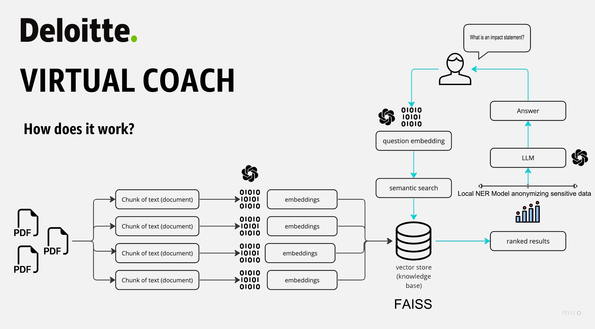

# Virtual Coach

## Introduction
------------
The  Virtual Coach is a LangChain application that allows you to chat with company-specific data. You can ask questions about the PDFs using natural language, and the application will provide relevant responses based on the most similar content in the documents. This app utilizes GPT-3.5-turbo, FAISS vector store and OpenAI embeddings to generate accurate answers to your queries. Please note that the app is restricted to respond only to the questions related to loaded PDFs. This data is sourced from publicly available articles, hence does not represent the company or use proprietary data in any way. This project is just a representation of the actual POC built by me.

## How It Works
------------



## Dependencies and Installation
----------------------------
To install the Virtual Coach, please follow these steps:

1. Clone the repository to your local machine and set up the environment using venv.

2. Install the required dependencies in the virtual environment by running the following command:
   ```
   pip install -r requirements.txt
   ```

3. Obtain an API key from OpenAI and add it to the `.env` file in the project directory (Incase you want to use Open Source models, add your HuggingFace API key)

4. Do not forget to download the spacy NER model after installing requirements for PII anonymisation. 
(Reference: https://microsoft.github.io/presidio/installation/)

5. The source images are stored in ./images. You can host them online and pass the link to ./htmlTemplates.py in case the current links expire.

## Improvements over previous versions
----------------------------
The following are the improvements over the last version using GPT-index & Gradio:

1. You can now use both OpenAI's GPT-3.5-turbo model as well as all the available inferences of Open Source models on HuggingFace (No GPU required, Data is private). 

2. You can also use the open source instructor embeddings if your company does not want to go ahead with OpenAI embeddings (requires GPU compute)

3. Chat history is now maintained to each session. Now, every previous message is passed as a context chain to the model, thus maintaining conversation history, thanks to LangChain. However, presistent conversation history can be brought by using chromaDB/Qdrant as a vector store instead of the current FAISS implementation, even after closing the application!

4. Despite OpenAI's pledge to privacy, Personal Identifiable Information is now redacted or masked with a placeholder (entity_tag) using Microsoft's Persidio SDK and a nimble NER model before sending it as a prompt through the API endpoints. This allows for an efficient, low-cost implementation of a fine-tuned model using ICL while allowing complete data privacy. However, the entity_tags and deanonymization process can be further customized to Deloitte's requirements. 
(Reference: https://openai.com/policies/api-data-usage-policies)

5. A new feature to upload your own PDFs so that the private data is localized, OpenAI tokens are saved and the application stays light.

## Usage
-----
To use the Virtual Coach, follow these steps:

1. Ensure that you have installed the required dependencies and added the OpenAI API key to the `.env` file.

2. Run the `main.py` file using the Streamlit CLI. Execute the following command:
   ```
   streamlit run app.py
   ```

3. The application will launch in your default web browser, displaying the user interface.

4. Load multiple PDF documents into the app by following the provided instructions.

5. Ask questions in natural language about the loaded PDFs using the chat interface.

## V1 ideation
-----
1. We are targeting a coach type Assistant for a “shy, introvert FE CR persona” for V1 - that can help the individual with career paths, summarize expectation framework, hot tech stack, answer queries on values and culture..
2. V1 will also be available for Coach - summarizes the questions the coachees had and the answers it provided, recommend topics to have a conversation about.
3. Previous presentations are located in ./slides

## Developed By:
-----
Kaushikq Ravindran
